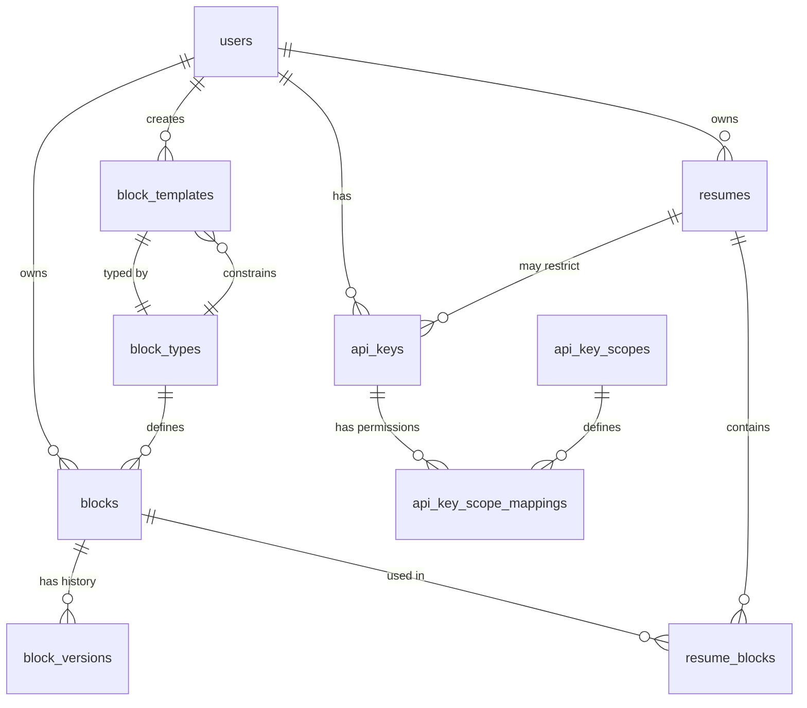

# Resume Block System Database Schema

## Overview

The Resume Block System uses a flexible, block-based architecture that allows users to create dynamic resumes from reusable content blocks. This document describes the database schema that supports this system.

## Entity Relationship Diagram



## Core Tables

### 1. `block_types`
Defines the 15 available block types and their validation schemas.

| Column | Type | Description |
|--------|------|-------------|
| id | UUID | Primary key |
| name | TEXT | Unique identifier (e.g., 'avatar', 'contact') |
| display_name | TEXT | Human-readable name |
| category | TEXT | One of: 'personal', 'professional', 'qualifications', 'additional' |
| schema | JSONB | JSON Schema for validation |
| icon | TEXT | Icon identifier for UI |
| description | TEXT | Help text for users |
| supports_multiple | BOOLEAN | Whether multiple instances are allowed |
| created_at | TIMESTAMP | Creation timestamp |
| updated_at | TIMESTAMP | Last update timestamp |

### 2. `blocks`
Stores actual block content created by users.

| Column | Type | Description |
|--------|------|-------------|
| id | UUID | Primary key |
| type | TEXT | Block type identifier |
| type_id | UUID | Foreign key to block_types |
| name | TEXT | User-defined name for the block |
| data | JSONB | Block content following type schema |
| metadata | JSONB | Additional metadata |
| visibility | TEXT | 'public' or 'private' |
| user_id | UUID | Owner of the block |
| created_at | TIMESTAMP | Creation timestamp |
| updated_at | TIMESTAMP | Last update timestamp |

### 3. `resume_blocks`
Junction table linking resumes to blocks with positioning.

| Column | Type | Description |
|--------|------|-------------|
| id | UUID | Primary key |
| resume_id | UUID | Foreign key to resumes |
| block_id | UUID | Foreign key to blocks |
| position | INTEGER | Order within the resume |
| created_at | TIMESTAMP | When block was added to resume |

### 4. `block_versions`
Tracks historical versions of block content.

| Column | Type | Description |
|--------|------|-------------|
| id | UUID | Primary key |
| block_id | UUID | Foreign key to blocks |
| version_number | INTEGER | Sequential version number |
| data | JSONB | Snapshot of block data |
| metadata | JSONB | Snapshot of metadata |
| changed_by | UUID | User who made the change |
| change_description | TEXT | Auto-generated change summary |
| created_at | TIMESTAMP | When version was created |

### 5. `block_templates`
Reusable templates for quick block creation.

| Column | Type | Description |
|--------|------|-------------|
| id | UUID | Primary key |
| type_id | UUID | Foreign key to block_types |
| name | TEXT | Template name |
| description | TEXT | Template description |
| content | JSONB | Pre-filled block data |
| tags | TEXT[] | Searchable tags |
| is_public | BOOLEAN | Available to all users |
| is_featured | BOOLEAN | Highlighted in UI |
| user_id | UUID | Creator (NULL for system) |
| usage_count | INTEGER | Times used |
| created_at | TIMESTAMP | Creation timestamp |
| updated_at | TIMESTAMP | Last update timestamp |

## Block Types

The system supports 15 distinct block types:

### Personal Information (4 types)
1. **Avatar** - Profile picture or avatar
2. **Contact** - Email, phone, website
3. **Address** - Physical location or remote status
4. **Social Networks** - Social media profiles

### Professional Experience (3 types)
5. **Experience** - Work history
6. **Volunteer** - Community service
7. **Project** - Professional/personal projects

### Qualifications (5 types)
8. **Education** - Academic background
9. **Award** - Recognitions received
10. **Certificate** - Professional certifications
11. **Publication** - Published works
12. **Skill** - Technical/professional skills

### Additional Information (3 types)
13. **Natural Language** - Language proficiencies
14. **Interest** - Hobbies and interests
15. **Reference** - Professional references

## Key Features

### Version Control
- Every block update creates a version snapshot
- Users can view history and restore previous versions
- Automatic tracking via database triggers

### Template System
- Pre-built templates for each block type
- Public templates available to all users
- Private templates for personal use
- Featured templates highlighted in UI
- Usage tracking for popular templates

### Reusability
- Blocks can be used across multiple resumes
- Changes to a block reflect in all resumes using it
- Position tracking maintains order within each resume

### Security
- Row Level Security (RLS) enforces access control
- Users can only access their own blocks
- Public blocks/templates have broader access
- API keys provide granular permissions

## Database Functions

### Block Management
- `create_block_from_template(template_id, name)` - Create block from template
- `restore_block_version(block_id, version_number)` - Restore to previous version
- `get_block_version_history(block_id, limit, offset)` - Get version history

### Utility Functions
- `get_next_block_version_number(block_id)` - Get next version number
- `increment_template_usage(template_id)` - Track template usage
- `update_updated_at_column()` - Auto-update timestamps

## Indexes

Strategic indexes for optimal performance:
- Block lookups by type, user, and visibility
- Version history by block and timestamp
- Template searches by type, tags, and visibility
- Junction table queries by resume and block

## Migration Strategy

1. **Forward Migrations** (in order):
   - `20240101_block_types_enhancement.sql` - Create block_types table
   - `20240102_block_versions_table.sql` - Add version tracking
   - `20240103_block_templates_table.sql` - Add template system
   - `20240104_resume_blocks_enhancement.sql` - Enhance junction table

2. **Rollback Scripts** (if needed):
   - Each migration has a corresponding rollback script
   - Preserves user data where possible
   - Clear dependencies handled

3. **Application Process**:
   ```bash
   # Using Supabase CLI
   supabase db push
   
   # Or manually in order
   psql -f supabase/migrations/20240101_block_types_enhancement.sql
   psql -f supabase/migrations/20240102_block_versions_table.sql
   psql -f supabase/migrations/20240103_block_templates_table.sql
   psql -f supabase/migrations/20240104_resume_blocks_enhancement.sql
   ```

## Best Practices

1. **Data Integrity**
   - Always validate block data against type schema
   - Use transactions for multi-table operations
   - Maintain referential integrity

2. **Performance**
   - Index frequently queried columns
   - Use JSONB for flexible schema with indexing
   - Paginate large result sets

3. **Security**
   - Leverage RLS for access control
   - Validate permissions before operations
   - Audit sensitive changes

4. **Versioning**
   - Automatic version tracking via triggers
   - Preserve history for compliance
   - Allow rollback capabilities